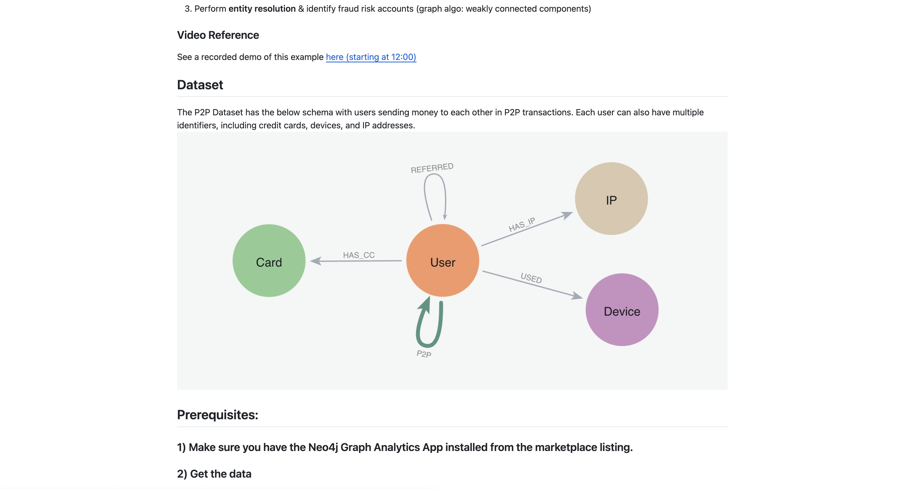
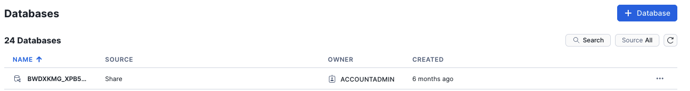
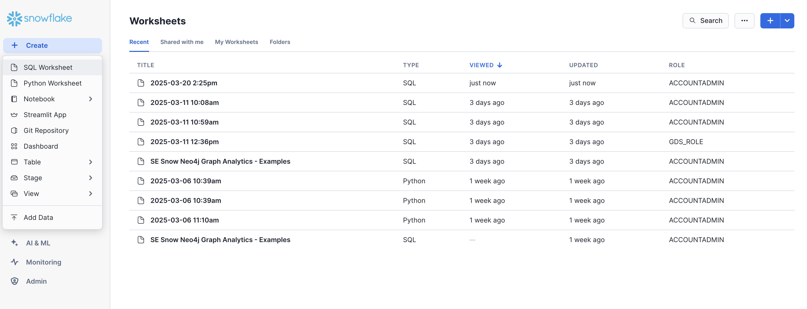
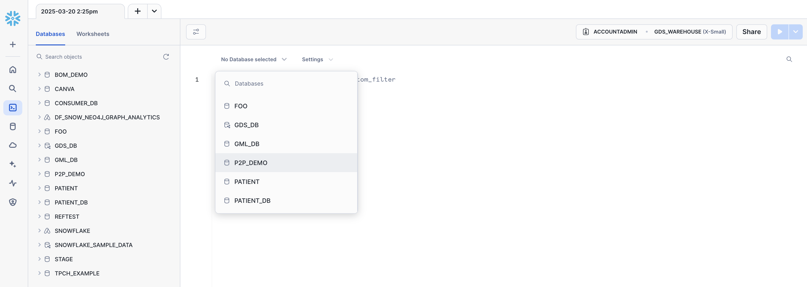

# **Community Detection in Neo4j Graph Analytics on Snowflake**

## **Overview**
This guide provides a step-by-step approach to running **community detection graph algorithms** using **Neo4j Graph Analytics for Snowflake**. In this quickstart, you will learn how to set up Neo4j Graph Analytics, construct graphs, run community detection algorithms like Louvain, and store results in Snowflake.
### **What is Neo4j Graph Analytics for Snowflake?**  

Neo4j, the Graph Database & Analytics leader, helps organizations find hidden relationships and patterns across billions of data connections deeply, easily, and quickly. **Neo4j Graph Analytics for Snowflake** brings to the power of graph directly to Snowflake, allowing users to run 65+ ready-to-use algorithms on their snowflake data, all without leaving Snowflake! 


### **Dataset Overview**
The dataset used in this guide represents peer-to-peer (P2P) financial transactions where users transfer money between each other. Users may have multiple identifiers, including credit cards, devices, and IP addresses, enhancing the complexity and richness of the data. This structure makes it ideal for identifying clusters, influencers, and fraudulent behaviors.




### What you will learn

- How to prepare and project your data for graph analytics
- How to use community detection to identify fraud
- How to read and write directly from and to your snowflake tables

### **Prerequisites**
**Snowflake Account & Access**
1. Active Snowflake account with appropriate access to databases and schemas.
2. Neo4j Graph Analytics application installed from the Snowflake marketplace. Access the marketplace via the menu bar on the left hand side of your screen, as seen below:
   
3. Load in the CSVs as tables in snowflake. The data can be found in the `data` folder of this repo. Follow the instructions found [here](https://docs.snowflake.com/en/user-guide/data-load-web-ui) to load in each csv as their own table.
   - `p2p_transactions.csv` should be 

## Step 1: Create a Database and Load Data

Click "Data" on the left hand menu bar and then look for the blue buttom reading "+ Database" as seen on the right hand side:



Let's name our database **P2P_DEMO**. Using the CSVs found [here](https://github.com/corydonbaylor/quickstart-drafts/tree/main/louvain/data), We are going to add two new tables:

- one called **P2P_TRANSACTIONS** based on the `p2p_transactions.csv`  
- one called **P2P_USERS** based on `p2p_users.csv`

Follow the steps found [here](https://docs.snowflake.com/en/user-guide/data-load-web-ui) to load in your data.

## Step 2 :Create a new worksheet and select database 

In order to run Graph Analytics, we will need to create a new SQL worksheet:



And select our database to work with:



## **Step 3: Prepare Data**
Now that we have our worksheet and have selected our database, we can easily start manipulating our data using SQL for our analysis. We are first going to create a new table with the aggregated transactions between users like so:
```sql
CREATE OR REPLACE TABLE p2p_demo.public.P2P_AGG_TRANSACTIONS (
	SOURCENODEID NUMBER(38,0),
	TARGETNODEID NUMBER(38,0),
	TOTAL_AMOUNT FLOAT,
	TRANSACTION_COUNT FLOAT
) AS
SELECT sourceNodeId, targetNodeId, SUM(transaction_amount) AS total_amount, COUNT(*) AS transaction_count
FROM p2p_demo.public.P2P_TRANSACTIONS
GROUP BY sourceNodeId, targetNodeId;
SELECT * FROM p2p_demo.public.P2P_AGG_TRANSACTIONS;
*/

CREATE OR REPLACE TABLE p2p_demo.public.P2P_AGG_TRANSACTIONS (
	SOURCENODEID NUMBER(38,0),
	TARGETNODEID NUMBER(38,0),
	TOTAL_AMOUNT FLOAT
) AS
SELECT sourceNodeId, targetNodeId, SUM(transaction_amount) AS total_amount
FROM p2p_demo.public.P2P_TRANSACTIONS
GROUP BY sourceNodeId, targetNodeId;
SELECT * FROM p2p_demo.public.P2P_AGG_TRANSACTIONS;
```
Note that we need to have a particular structure for Graph Analytics to work:

**For the table representing nodes:**

- The first column should be called `nodeId`, which represents the ids for the each node in our graph

**For the table representing relationships:**

- We need to have columns called `sourceNodeId` and `targetNodeId`. These will tell Graph Analytics the direction of the transaction, which in this case means:
  - Who sent the money (`sourceNodeId`) and 
  - Who received it (`targetNodeId`)
- We also include a `total_amount` column that acts as the weights in the relationship

## Step 4 : Setup & Access Configuration

Now that we have our data in the right format, we need to make sure to configure roles, grant permissions, and initialize the Neo4j Graph Analytics application in Snowflake. 

*Note: You can find more details about granting permissions [here](https://app.snowflake.com/hiysshm/neo4j_emea_field/#/apps/application/DF_SNOW_NEO4J_GRAPH_ANALYTICS/security/readme?isPrivate=true).*

```SQL
-- Creates a role for users to analyze data
CREATE ROLE IF NOT EXISTS gds_role;
GRANT APPLICATION ROLE neo4j_graph_analytics.app_user TO ROLE gds_role;

-- Creates a role for managing the application
CREATE ROLE IF NOT EXISTS gds_admin_role;
GRANT APPLICATION ROLE neo4j_graph_analytics.app_user TO ROLE gds_role;

-- The application needs read access to transaction data and write permissions for storing results.
GRANT USAGE ON DATABASE p2p_demo TO APPLICATION neo4j_graph_analytics;
GRANT USAGE ON SCHEMA p2p_demo.public TO APPLICATION neo4j_graph_analytics;

-- Grants `SELECT` permission for the Snowflake application role so it can read tables. Without this, the Neo4j GDS application cannot load data from your tables to create a graph.
GRANT SELECT ON ALL TABLES IN SCHEMA p2p_demo.public TO APPLICATION neo4j_graph_analytics;

-- Grants `CREATE TABLE` permission so GDS can store any analytics outputs (e.g., results of Louvain) in new tables.
GRANT CREATE TABLE ON SCHEMA p2p_demo.public TO APPLICATION neo4j_graph_analytics;

-- Ensures that any new tables created in the future by the application are automatically accessible to the roles in question. This is optional but convenient for a frictionless workflow.
GRANT ALL PRIVILEGES ON FUTURE TABLES IN SCHEMA p2p_demo.public TO ROLE gds_role;
GRANT ALL PRIVILEGES ON FUTURE TABLES IN SCHEMA p2p_demo.public TO ROLE accountadmin;
GRANT ALL PRIVILEGES ON ALL TABLES IN SCHEMA p2p_demo.public TO ROLE accountadmin;

-- Creates a compute session for the engine on Snowflake using a specified compute model (CPU_X64_M). This step is required before running graph algorithms.
CALL neo4j_graph_analytics.gds.create_session('CPU_X64_M');

-- Drop any existing graph named transaction_graph so you can recreate it from scratch. Using { 'failIfMissing': false } to avoids errors if the graph does not exist yet.
SELECT neo4j_graph_analytics.gds.graph_drop('transaction_graph', { 'failIfMissing': false });
USE DATABASE p2p_demo;
```


## Step 5 : Load Data from Snowflake
Before we proceed, it might be worth taking a look at our tables and taking stock of where we stand:

- User Table (Nodes): Represents individual users (nodes) identified uniquely by user IDs.
- Transaction Table (Relationships): Contains aggregated transactions between users, forming relationships in the graph.

```sql
USE DATABASE p2p_demo;
USE SCHEMA public;
SELECT * FROM p2p_users;
SELECT * FROM p2p_agg_transactions;
```
## Step 6 : Construct a Graph Projection
*<u>**THIS IS WILL CHANGE WITH UPDATED SYNTAX**</u>*

Next, with just some simple transformations, we can prepare our tabular data to work with a graph model. In our case:

- Users → Nodes

- Transactions → Edges (Relationships)


```sql
SELECT neo4j_graph_analytics.gds.graph_project('transaction_graph',{
  'nodeTables': {
    'p2p_demo.public.p2p_users': 'Node'
  },
  'relationshipTables': {
    'p2p_demo.public.p2p_agg_transactions': {
      'type': 'REL',
      'sourceTable': 'p2p_demo.public.p2p_users',
      'targetTable': 'p2p_demo.public.p2p_users',
      'orientation': 'NATURAL'
    }
  }
});
```
## Step 7:  Run Louvain Community Detection
*<u>**THIS IS WILL CHANGE WITH UPDATED SYNTAX**</u>*

The louvain algorithm is a popular method for detecting communities in large networks by optimizing modularity. Modularity measures the density of links inside communities compared to links between communities. This makes Louvain particularly useful for applications such as customer segmentation, fraud detection, and social network analysis.

Now that we know how it works, let's see what we get:

```sql
SELECT neo4j_graph_analytics.gds.louvain('transaction_graph', {'mutateProperty': 'community_id'});

-- Write  to table
SELECT neo4j_graph_analytics.gds.write_nodeproperties_to_table('transaction_graph', {
  'nodeLabels': ['Node'],
  'nodeProperties': ['community_id'],
  'tableSuffix': '_louvain'
});
```

Note: the `{'mutateProperty': 'community_id'}` parameter tells us to store each node’s community identifier as community_id. What this does is that it group users into communities based on transaction activity.

## Step 8: Store and Analyze Community Results

*<u>**THIS IS WILL CHANGE WITH UPDATED SYNTAX**</u>*

Persist Louvain results in Snowflake and analyze community structures.

This helps us retreive all rows from your newly written table (e.g., p2p_users_louvain) so you can see which community each user belongs to.
```sql
SELECT * FROM p2p_users_louvain ORDER BY community_id;
```
This step aggregates the user communities by counting how many nodes exist in each. This query helps you identify the largest or most active communities.
```sql
SELECT community_id, count(nodeid) AS community_size
FROM p2p_users_louvain
GROUP BY community_id
ORDER BY community_size DESC LIMIT 10;
```

## Step 9: Run PageRank to find the most influential users
*<u>**THIS IS WILL CHANGE WITH UPDATED SYNTAX**</u>*

The PageRank algorithm helps identify the most influential or central nodes in a network by considering both the quantity and quality of their connections. In the context of P2P financial transactions, PageRank can be used to find key users—whether they are influential customers or suspicious actors in a fraud ring.

Let’s run the PageRank algorithm using Neo4j Graph Analytics directly inside Snowflake!
```sql
SELECT neo4j_graph_analytics.gds.page_rank('transaction_graph', {'mutateProperty': 'page_rank'});
```
Once the PageRank scores are computed, we’ll write them to a new Snowflake table (e.g., p2p_users_pagerank) so you can query and analyze them further.
```sql
SELECT DF_SNOW_NEO4J_GRAPH_ANALYTICS.gds.write_nodeproperties('transaction_graph', {
    'nodeLabels': ['Node'],
    'nodeProperties': ['score'], 
    'tableSuffix': '_pagerank'
});
```
You can now view the most influential users based on their PageRank score.

```sql
SELECT * FROM p2p_users_pagerank ORDER BY score DESC limit 5;
```

## Step 10: Quick Visualization
Once Louvain and PageRank scores are computed, you can visualize specific communities to explore user behavior, influence, and structure.


## **Summary**

In this quickstart, you learned how to bring the power of graph analytics into Snowflake using Neo4j Graph Analytics. By working with a P2P transaction dataset, you were able to:

1. Set up the Neo4j Graph Analytics application within Snowflake.
2. Prepared and projected your data into a graph model (users as nodes, transactions as edges).
3. Ran Louvain community detection to identify clusters of users with high internal interaction.
4. Applied PageRank to find the most influential users within the network.


